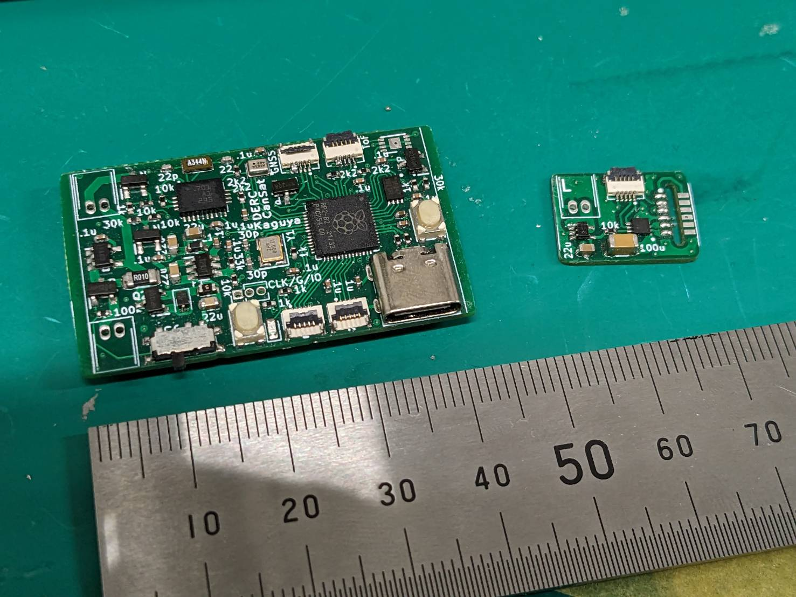
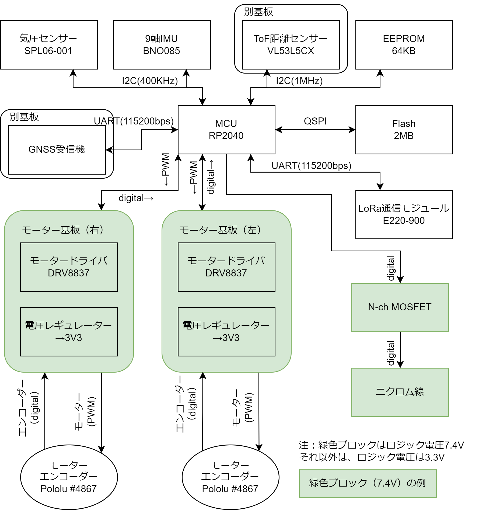
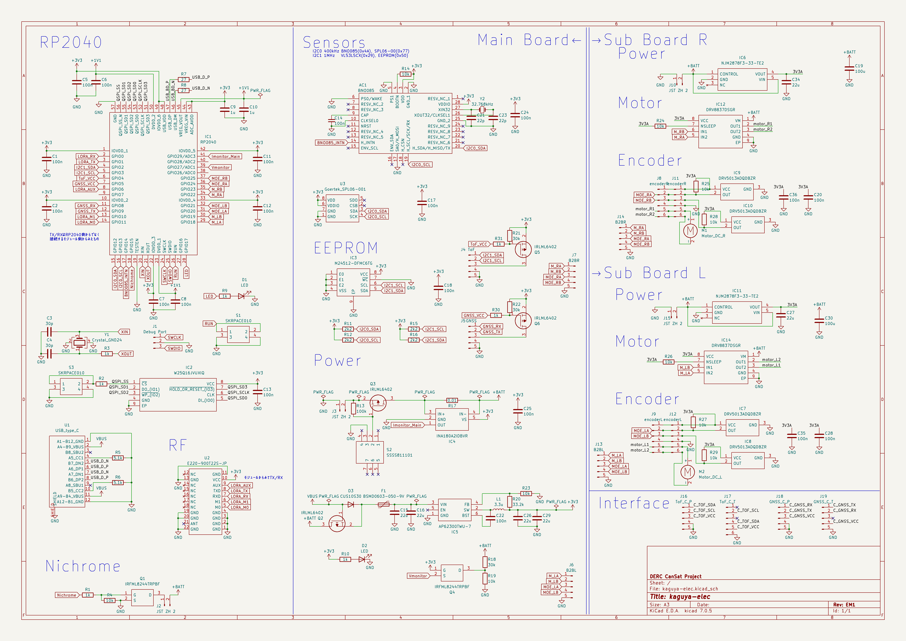
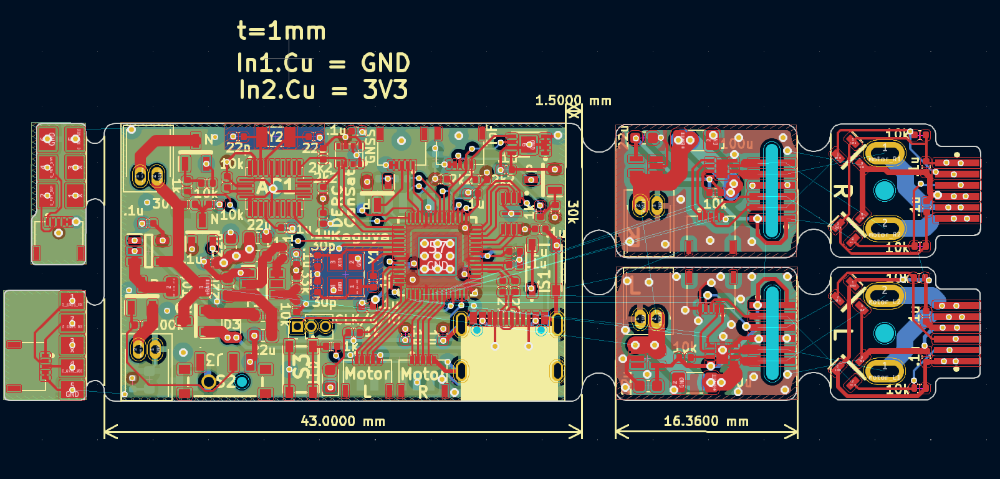
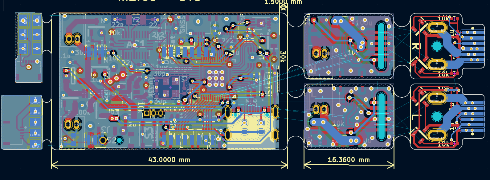
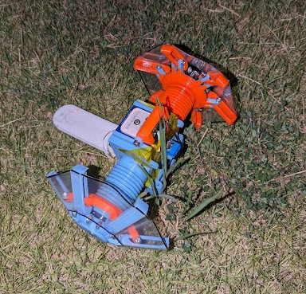

# kaguya-elec

CanSatのための小型電装基板です。第19回能代宇宙イベント出場機体『かぐや』（同志社大学）のために作りました。

- 大幅な小型化を実現しました（当団体比）。42x25mmでここまでできる！
- 安定して動作しています。
- 50mから自由落下しても故障しませんでした（投下1回目）。

ブロック図：

中身としては、RP2040を中心に、電源(DCDC)、無線（LoRa）、センサー（9軸IMU・気圧）、外付けセンサー用コネクタ（GPS・ToF測距）といった感じです。なお、モータードライバは別の基板として分離して使うようにしてあります。

回路図（詳しくはKiCadのデータを参照）：

アートワーク：
表：

裏：

## 『かぐや』について

第19回能代宇宙イベント出場機体『かぐや』（同志社大学）の基板です。
この機体の特徴：
- 成功率向上のため、2機体投下
    - タテに二つ重ねて投下するのでなく、制御性向上のため、ヨコに2つ並べてキャリアに収納
    - そのためのタイヤ展開
- 小型の基板

3回投下した中で、投下2回目の7mが最良の結果でした。実際の状況は大会報告書を参照されたいですが、走破性の不足によるスタックが一番の問題でした（3回ともプログラムは正常に動作・ログ取得）。
- 機体：運営特別賞
- ポスター：能代ロケット実験場　所長賞

なお、この基板で動かしたコードもGitHub上で公開しています。
[リンク](https://github.com/Yudetamago-AM/kaguya-code)